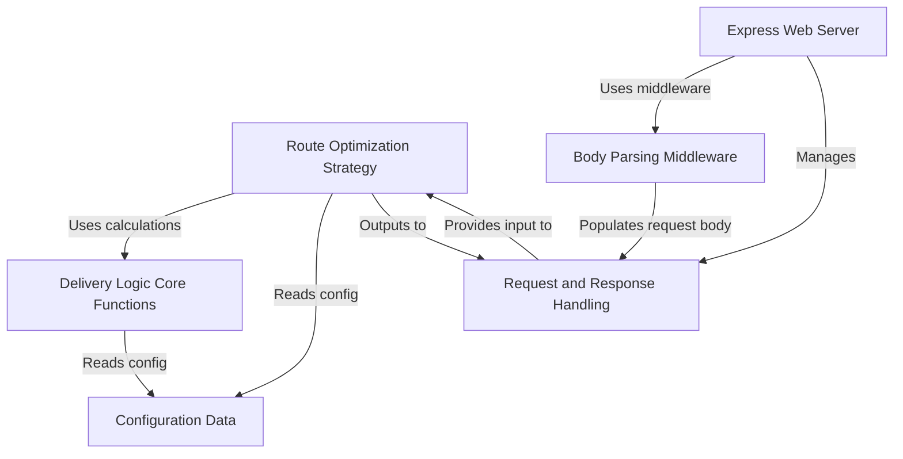

# Tutorial: Shortest-distance

This project is a **web service** that calculates the *minimum cost* to deliver products.
It receives an order via an API endpoint, figures out the best route by considering *different paths* between distribution centers and the delivery location, and applies *specific cost rules* based on weight and distance, using predefined data about products and locations.

## Visual Overview

## Chapters

1. [Express Web Server
](01_express_web_server_.md)
2. [Request and Response Handling
](02_request_and_response_handling_.md)
3. [Body Parsing Middleware
](03_body_parsing_middleware_.md)
4. [Route Optimization Strategy
](04_route_optimization_strategy_.md)
5. [Delivery Logic Core Functions
](05_delivery_logic_core_functions_.md)
6. [Configuration Data
](06_configuration_data_.md)

---

Generated by [AI Codebase Knowledge Builder](https://github.com/The-Pocket/Tutorial-Codebase-Knowledge).
